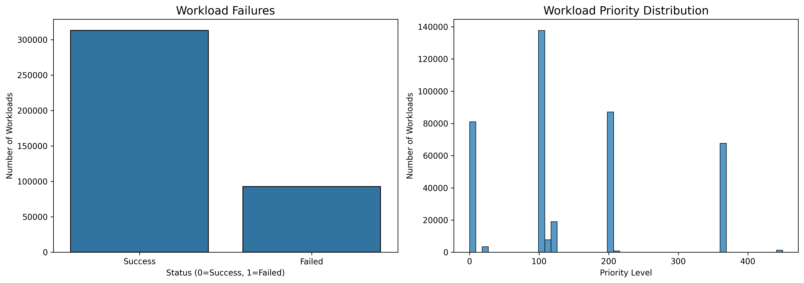
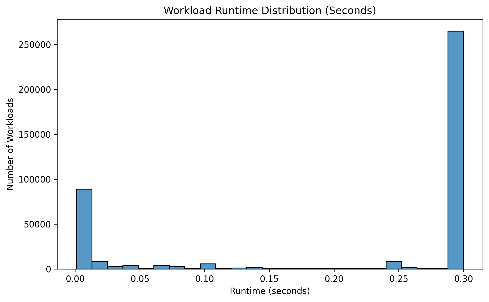
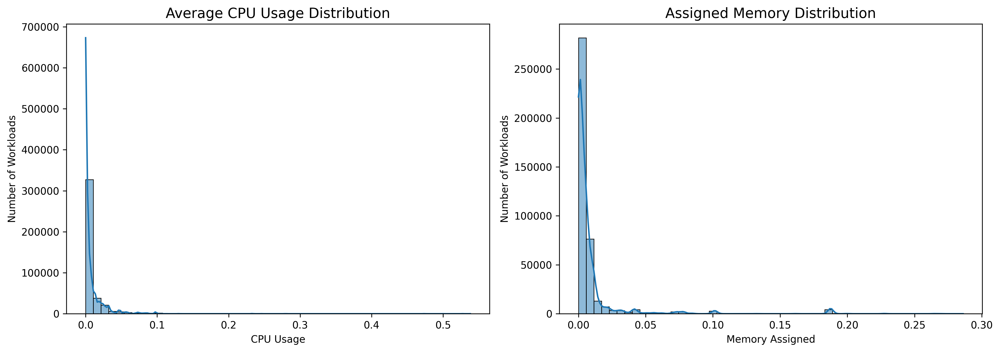
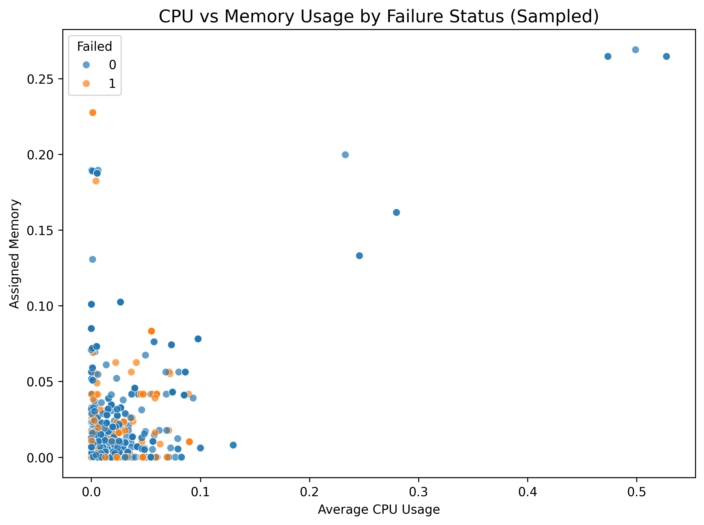
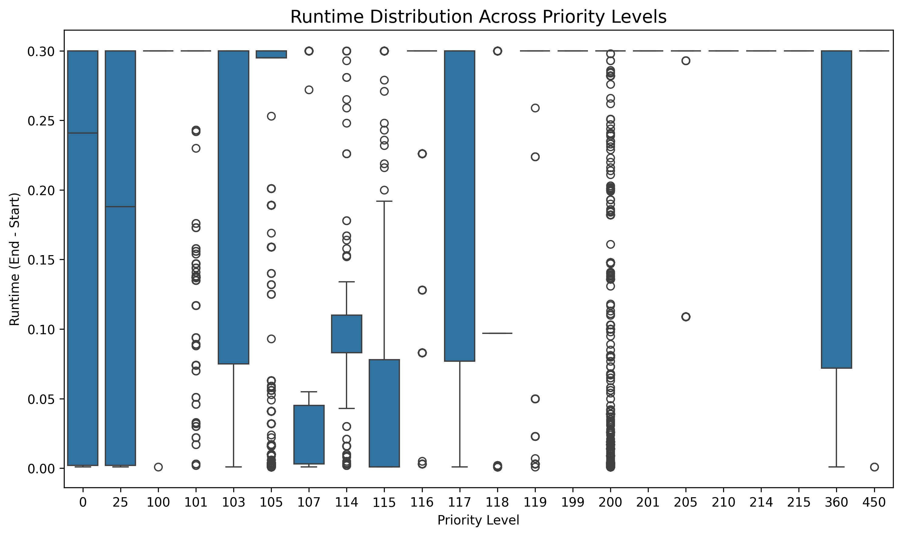
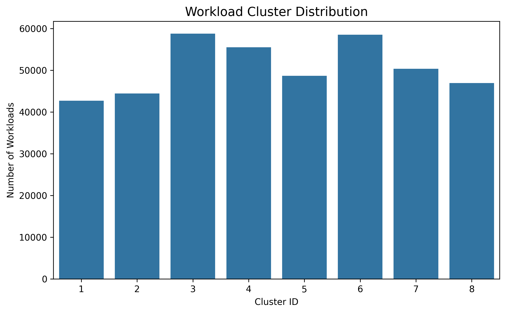
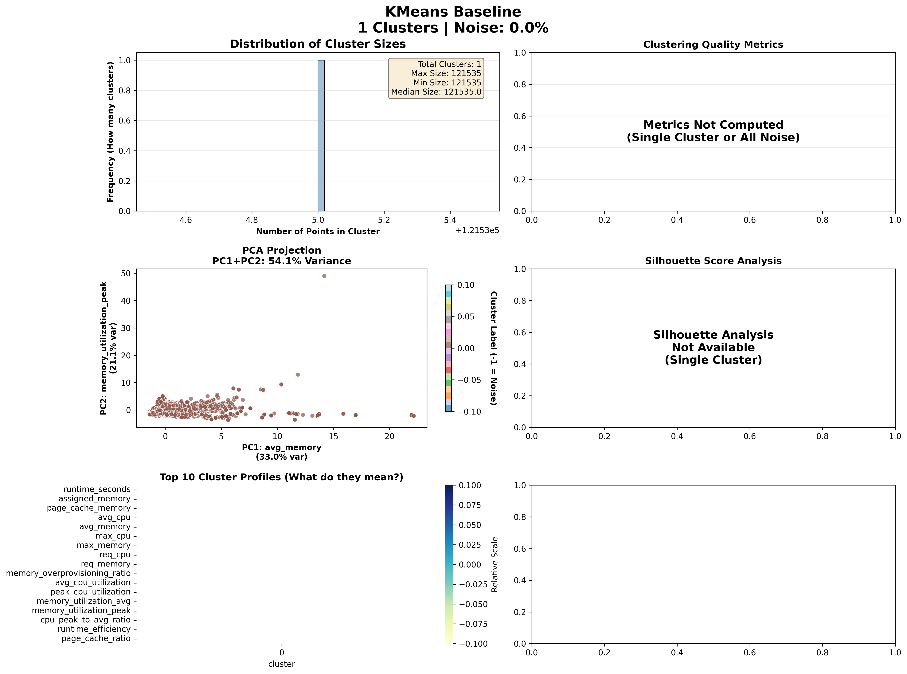
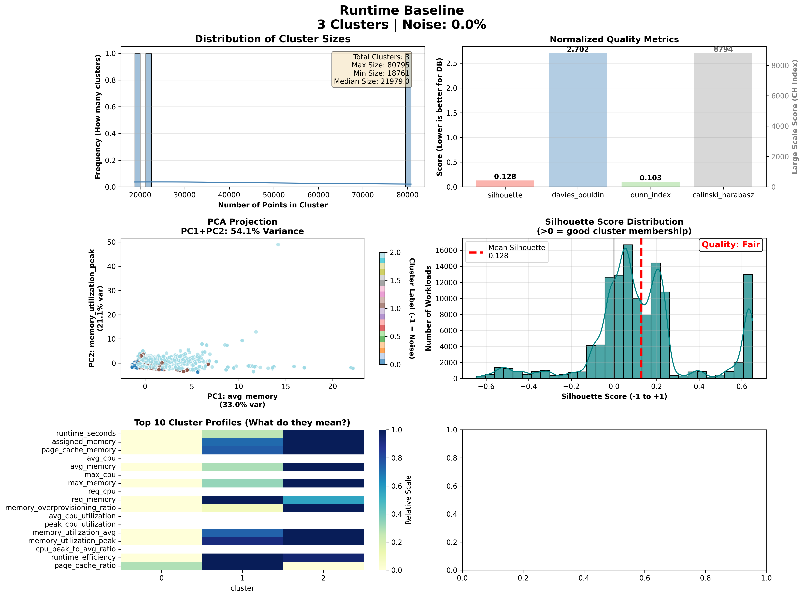

# Workload Profiler

## Project Overview

This project presents a data-driven framework for automatically discovering and characterizing distinct workload types in large-scale compute clusters. Using the Google 2019 Cluster Sample (derived from Google’s production cluster traces), the system analyzes job and task-level resource requests, observed CPU and memory utilization patterns, runtime characteristics, and scheduling metadata to identify meaningful behavioral segments.

By transforming raw time-series usage data into structured workload profiles, the project applies dimensionality reduction and unsupervised clustering techniques to uncover natural workload categories. These categories may include short, bursty batch jobs, long-running latency-sensitive services, memory-intensive analytics tasks, and other operationally distinct patterns.

The primary objective is to provide actionable insights for infrastructure and network operations teams. By understanding how workloads differ in resource intensity, variability, and efficiency, stakeholders can design differentiated scheduling policies, optimize capacity planning, and implement predictive autoscaling strategies tailored to each workload type.

Ultimately, this approach enhances resource utilization, reduces overprovisioning, mitigates performance bottlenecks, and supports more intelligent, behavior-aware cluster management.

The full analysis and implementation is available in the **[Jupyter Notebook: Workload_Profiler.ipynb](./Workload_Profiler.ipynb)**, which delivers actionable insights.

 The final report is available at **[Workload Profiler Report](https://vinnybabumanjaly.github.io/WorkloadProfiler/)**.

## 1 Business understanding

### 1.1 Business Objectives

#### Task 

The goal is to understand, from a business perspective, what the organization wants to achieve with workload analysis and resource optimization. The analyst must uncover the key factors influencing operational efficiency, resource usage, and scheduling, ensuring the project focuses on solving the right business problems rather than just producing technical results.

#### Background

The organization manages large-scale compute clusters with diverse workloads, including short batch jobs, long-running latency-sensitive services, and memory-intensive analytics tasks. Current challenges include inefficient resource utilization, overprovisioning, unpredictable job performance, and limited insights for designing effective scheduling and autoscaling policies.

#### Business Objectives

Primary Objective:

* Automatically discover and categorize distinct workload types to improve operational efficiency and resource allocation across clusters.

Related Business Questions:

* Which workloads consume the most resources and how consistently?
* Are there overprovisioned tasks or jobs that could be scaled down without impacting performance?
* How can workload grouping inform predictive autoscaling and differentiated scheduling policies?
* Can clusters be managed to reduce potential SLA violations or job slowdowns?

#### Business Success Criteria

* Clear identification of meaningful workload groups with distinct resource and runtime patterns.
* Actionable insights for infrastructure teams to optimize scheduling and autoscaling strategies.
* Improved resource efficiency, measured by simulated KPIs such as CPU/memory utilization, cost estimation, and SLA risk scores.
* Subjective validation by stakeholders that the workload profiles and metrics are relevant, interpretable, and support operational decision-making.

### 1.2 Assess Situation

#### Inventory of Resources

Data Resources

* Google 2019 Cluster Sample dataset (job/task events, CPU/memory usage, scheduling metadata)
* Aggregated per-job/task feature tables (engineered metrics)

Technical Resources

* Python (Pandas, NumPy, Scikit-learn)
* PCA and clustering libraries (K-Means, GMM, DBSCAN)
* Visualization tools (Matplotlib / Seaborn)
* Local workstation or cloud compute environment

Expertise

* Data analysis and machine learning knowledge
* Understanding of distributed systems and workload behavior
* Basic business understanding of infrastructure operations

#### Requirements, Assumptions, and Constraints

Requirements

* Identify 4–8 meaningful workload clusters
* Ensure results are interpretable for operations teams
* Maintain data privacy and comply with dataset usage terms
* Deliver clear documentation and visualizations

Assumptions

* CPU and memory usage patterns reflect workload behavior accurately
* Resource usage is a reasonable proxy for cost and SLA risk
* Clusters discovered represent operationally meaningful categories

Constraints

* No real cost, SLA, or business KPI data available
* Large dataset size may require sampling or aggregation
* Simulated cost and SLA metrics are approximations, not exact values

#### Risks and Contingencies

| Risk                            | Impact                  | Contingency Plan                                          |
| ------------------------------- | ----------------------- | --------------------------------------------------------- |
| Clusters are not well separated | Low interpretability    | Try alternative algorithms (GMM, DBSCAN), refine features |
| High dimensionality noise       | Poor clustering quality | Apply PCA and feature selection                           |
| Dataset scale limitations       | Performance issues      | Use sampling or distributed processing                    |
| Simulated KPIs lack realism     | Limited business value  | Clearly communicate assumptions and limitations           |

#### Terminology

Business Terms

* Workload – A job or task executed in the cluster
* Overprovisioning – Allocating more resources than actually used
* Autoscaling – Automatically adjusting resources based on demand
* SLA (Service Level Agreement) – Performance and reliability commitments

Data Science Terms

* PCA (Principal Component Analysis) – Reduces correlated features into key components
* Clustering – Grouping similar workloads based on patterns
* Silhouette Score – Measures cluster separation quality
* Feature Engineering – Transforming raw data into modeling-ready metrics

#### Costs and Benefits

Costs

* Engineering time for data processing and modeling
* Compute resources for large-scale clustering
* Time spent validating and interpreting clusters

Potential Benefits

* Improved resource utilization and reduced overprovisioning
* Smarter scheduling and autoscaling policies
* Reduced risk of slowdowns and SLA violations
* Better operational visibility into workload behavior

Even without direct cost data, the project can support measurable improvements in efficiency and decision-making.

### 1.3 Determine Data Mining Goals

#### Data Mining Goals

The goal of this project is to use clustering techniques to automatically discover distinct workload types based on CPU usage, memory consumption, runtime behavior, and scheduling metadata.

Specifically, we aim to:

* Engineer meaningful features from raw task and job-level data
* Reduce dimensionality using PCA to simplify complex patterns
* Apply clustering algorithms (e.g., K-Means, GMM) to group similar workloads
* Profile and interpret each cluster in terms of usage patterns, efficiency, and SLA risk
* Generate simulated KPIs such as resource efficiency, cost estimation, and potential SLA violations

The final output should be clearly defined workload categories that operations teams can use for smarter scheduling and autoscaling decisions.

#### Data Mining Success Criteria

The project will be considered successful if:

* Clusters show clear separation (e.g., strong Silhouette Score or other validation metrics)
* Each cluster has distinct and interpretable resource usage patterns
* Results are stable across sampling or parameter changes
* The identified workload groups translate into actionable operational insights

Ultimately, success means the technical outputs (clusters and metrics) are reliable, explainable, and useful for decision-making - not just mathematically correct.

### 1.4 Project Plan

This project will be completed in structured phases to ensure both the business goals and technical goals are achieved.

Stage 1: Data Understanding

Goal: Understand the dataset structure and available features.

* Review all columns and data types
* Identify missing values and inconsistencies
* Understand job/task relationships

Inputs: Raw cluster dataset
Outputs: Clean understanding of data schema
Risks: Large dataset size → may require sampling

Stage 2: Data Preparation & Feature Engineering

Goal: Convert raw logs into meaningful workload features.

* Calculate runtime, average/peak CPU and memory
* Compute efficiency and overprovisioning metrics
* Normalize and scale features

Inputs: Raw dataset
Outputs: Modeling-ready feature table
Dependencies: Stage 1 must be completed

Stage 3: Dimensionality Reduction

Goal: Simplify high-dimensional features.

* Apply PCA
* Select components explaining most variance
* Visualize component behavior

Outputs: Reduced feature dataset
Risk: Too much information loss → adjust number of components

Stage 4: Clustering & Modeling 

Goal: Identify workload groups.

* Apply K-Means (k = 4–8)
* Evaluate using Silhouette Score
* Compare with alternative models (GMM or DBSCAN if needed)

Outputs: Cluster labels for workloads
Iteration: Repeat modeling if clusters are not well separated

Stage 5: Cluster Profiling & KPI Simulation

Goal: Translate clusters into business insights.

* Analyze CPU/memory patterns per cluster
* Simulate cost, SLA risk, efficiency metrics
* Assign meaningful names to workload types

Outputs: Interpretable workload categories + KPI dashboard

Stage 6: Evaluation & Review

Goal: Validate usefulness and stability.

* Check cluster consistency
* Validate interpretability
* Review with stakeholders

Success Criteria:

* Clear separation between clusters
* Actionable insights for scheduling and autoscaling

#### Risk Management & Contingency

* If clustering quality is poor → refine features or try different algorithms
* If dataset is too large → apply sampling or aggregation
* If results lack interpretability → simplify features and improve profiling

#### Review Points

At the end of each stage, results will be reviewed and the plan updated if needed. The modeling and evaluation stages may be repeated until meaningful workload groups are found.

## 2. Data understanding

### 2.1 Collect Initial Data

The first step of this project is to acquire and load the Google 2019 Cluster Sample dataset. This dataset contains job and task-level logs, including resource requests, CPU/memory usage patterns, scheduling metadata, and task lifecycle events.

This step ensures the data is accessible and ready for deeper understanding and preparation.

Dataset Name: [Google 2019 Cluster Sample](https://www.kaggle.com/datasets/derrickmwiti/google-2019-cluster-sample)
Source: Kaggle (derived from Google cluster trace v3)

Storage Location:[Borg Traces Data](./data/borg_traces_data.csv)

Method of Acquisition:
* Downloaded dataset from Kaggle.
* Extracted raw CSV file from compressed file.
* Loaded selected tables into Python using Pandas.

### 2.2 Describe Data

After collecting the initial dataset, the next step is to understand its overall structure and surface characteristics. At this stage, we are not cleaning or transforming the data yet. Instead, we examine:

* The format of the data
* The number of records and features
* The meaning of each column
* Basic statistical properties
* Whether the dataset is suitable for our SLA, KPI, and cost modeling objectives

This step helps confirm that the data aligns with the project goals before moving into deeper preparation and modeling.

Each row represents a single instance execution record, and each column represents either:

* Identification information (e.g., collection_id, instance_index)
* Scheduling metadata
* Resource request details
* Resource usage measurements
* Performance indicators (e.g., failure status)

The dataset is structured and tabular, making it well-suited for analysis using Python (Pandas).

The dataset contains **405,894 workload instance records** with **34 features**, providing a large and detailed view of cluster activity. It includes scheduling metadata, resource requests, actual CPU and memory usage, timing information, and a failure indicator.

All critical fields required for SLA, KPI, and cost modeling, such as `start_time`, `end_time`, `assigned_memory`, `average_usage`, and `failed` are complete with no missing values. Some performance-specific metrics (e.g., cycles per instruction) contain missing values, but they do not affect the core objectives of this project.

A few columns are stored as strings and will require preprocessing before modeling. Overall, the dataset is structurally sound, sufficiently large, and well-suited for analyzing resource efficiency, reliability, and cost behavior in a cloud workload environment.

| Column                            | Data Type | Description                                                 |
| --------------------------------- | --------- | ----------------------------------------------------------- |
| `Unnamed: 0`                      | int64     | Original index column from CSV, can be ignored.             |
| `time`                            | int64     | Timestamp of the event (Unix epoch format).                 |
| `instance_events_type`            | int64     | Type of event for a workload instance (numeric code).       |
| `collection_id`                   | int64     | Unique identifier for a collection of workloads.            |
| `scheduling_class`                | int64     | Scheduling category of the workload.                        |
| `collection_type`                 | int64     | Type of workload collection (numeric code).                 |
| `priority`                        | int64     | Priority level assigned to the workload.                    |
| `alloc_collection_id`             | int64     | ID of the allocated collection for this instance.           |
| `instance_index`                  | int64     | Index of the workload instance within its collection.       |
| `machine_id`                      | int64     | Identifier of the machine executing the workload.           |
| `resource_request`                | str       | Requested resources (CPU, memory) for the workload.         |
| `constraint`                      | str       | Constraints on workload placement or execution.             |
| `collections_events_type`         | int64     | Type of event for the collection (numeric code).            |
| `user`                            | str       | User or owner of the workload.                              |
| `collection_name`                 | str       | Name of the collection.                                     |
| `collection_logical_name`         | str       | Logical name of the collection (business-readable).         |
| `start_after_collection_ids`      | str       | Dependencies: collection IDs that must finish first.        |
| `vertical_scaling`                | float64   | Whether vertical scaling is enabled for the workload (0/1). |
| `scheduler`                       | float64   | Scheduler assigned to handle the workload.                  |
| `start_time`                      | int64     | Start timestamp of the workload (Unix epoch).               |
| `end_time`                        | int64     | End timestamp of the workload (Unix epoch).                 |
| `average_usage`                   | str       | JSON string of average resource usage (CPU, memory).        |
| `maximum_usage`                   | str       | JSON string of maximum resource usage (CPU, memory).        |
| `random_sample_usage`             | str       | JSON string of sampled resource usage.                      |
| `assigned_memory`                 | float64   | Memory assigned to the workload (GB or normalized).         |
| `page_cache_memory`               | float64   | Memory used for page cache.                                 |
| `cycles_per_instruction`          | float64   | CPU cycles per instruction (performance metric).            |
| `memory_accesses_per_instruction` | float64   | Memory accesses per CPU instruction.                        |
| `sample_rate`                     | float64   | Sampling rate for resource usage measurements.              |
| `cpu_usage_distribution`          | str       | JSON string representing CPU usage distribution.            |
| `tail_cpu_usage_distribution`     | str       | JSON string representing tail CPU usage.                    |
| `cluster`                         | int64     | Cluster ID where the workload ran.                          |
| `event`                           | str       | Description or type of event (text).                        |
| `failed`                          | int64     | Whether the workload failed (0 = success, 1 = failed).      |

### 2.3 Explore Data

In this step, we dive deeper into the dataset to uncover patterns, distributions, and relationships that will guide modeling and analysis. The goal is to answer preliminary data mining questions and identify interesting trends or anomalies.

* Total workloads: 405,894
* Failed workloads: 92,678 (~22.8% failure rate)
* Clusters identified: 8 distinct workload groups

Runtime (seconds) insights:

* Most workloads are short, with the median runtime at 300 seconds (5 minutes).
* 25% of workloads run less than 41 seconds, and 75% run 300 seconds or less, indicating a large concentration of very short tasks.
* Maximum runtime is capped at 300 seconds, suggesting possible system-imposed limits or sampling constraints.

CPU usage:

* Average CPU usage is generally low, with a median of 0.0010 (normalized or fractional usage).
* Only a few workloads use a significant portion of CPU, with a max observed usage of 0.538.
* Most workloads are lightweight in CPU demand.

Memory usage:

* Memory assigned is modest for the majority of workloads, median 0.0027.
* 75% of workloads use less than 0.0067, but the highest memory-consuming task uses 0.286.
* Most workloads are memory-light, with only a few memory-intensive tasks.

Priority levels:

* Workloads are highly varied across priority levels, with some clusters like `103` and `360` having tens of thousands of workloads.
* Lower-numbered priorities (0, 25) have relatively few workloads, while mid-range priorities dominate.
* Indicates that the system schedules a mix of high-priority and batch workloads.

Cluster distribution:

* Workloads are fairly evenly distributed across 8 clusters, each ranging between ~42k and ~59k workloads.
* Suggests a good separation of workload types for clustering and behavior profiling.

Overall takeaway:

* The dataset is dominated by short, lightweight CPU and memory workloads, with a few outliers using more resources.
* Failure rate (~23%) is significant and may require investigation or prioritization in scheduling.
* Clusters appear balanced, making them useful for differentiated scheduling and autoscaling policies.

### 2.4 Data Quality

**Data Quality Summary**

* Missing Values

  * Most columns are complete.
  * Only `memory_accesses_per_instruction` and `cycles_per_instruction` have significant missing data (~31%).
  * Minor missing values in `vertical_scaling` (0.24%), `scheduler` (0.24%), and `resource_request` (0.19%).

* Duplicate Rows

  * No duplicate rows were found (excluding complex dict/list columns).

* Numeric Data Overview

  * Runtime (seconds): Most workloads complete within 300 seconds; mean runtime ~212s.
  * CPU Usage: Mostly low; median CPU usage ~0.001, maximum ~0.54.
  * Memory Usage: Mostly small; median assigned memory ~0.0027, maximum ~0.29.

* Invalid or Negative Values

  * No negative runtime, CPU, or memory usage values detected.

* Workload Failures

  * ~23% of workloads failed (`failed = 1`).

* Priority Levels

  * Majority of workloads use priorities 103, 200, 0, or 360.
  * Other priority levels appear less frequently, indicating uneven distribution across priorities.

* *Cluster Distribution

  * Workloads are distributed across 8 clusters; cluster 3 and 6 have the highest number of workloads (~58k each).

* Event Types

  * Both `instance_events_type` and `collections_events_type` have identical distributions.
  * Most common event types: 3, 2, 0, 6, and 5. Rare types like 8, 9, 10 appear very infrequently.

**Overall** 

* Data is mostly complete, numeric fields are valid, and no duplicates exist.
* Some missing data in CPU/memory instruction metrics may need attention for advanced analysis.
* Categorical fields (`priority`, `cluster`, `failed`) show expected distributions and are consistent.

## 3. Data preparation

### 3.1 Select Data

At this stage, we decide which parts of the dataset will actually be used for modeling.
Data selection is not only about choosing the right columns (features), but also about filtering the appropriate rows (records).

The goal is to retain data that is:

- Relevant to workload behavior and clustering
- Sufficient in quality and completeness
- Technically manageable given memory and computation constraints

Since this project focuses on discovering workload types using resource behavior and runtime characteristics, only features that meaningfully describe workload performance are selected

#### Included Columns

The following columns were selected because they directly contribute to workload behavior analysis, efficiency measurement, or clustering:

Identification Fields (Retained for grouping, not clustering):

* `collection_id`
* `instance_index`
* `machine_id`
* `cluster`
* `priority`

These help profile and interpret clusters after modeling but are not necessarily used as clustering features.

Time & Runtime Features (Critical):

* `start_time`
* `end_time`

Used to compute:

* Runtime
* Scheduling behavior
* SLA risk indicators

Resource Allocation & Usage (Core Features):

* `assigned_memory`
* `page_cache_memory`
* `average_usage`
* `maximum_usage`
* `cpu_usage_distribution`
* `tail_cpu_usage_distribution`
* `resource_request`

These features describe:

* CPU intensity
* Memory intensity
* Usage variability
* Overprovisioning behavior

These are central to workload profiling.

Reliability & KPI Fields:

* `failed`

Used to simulate SLA risk and analyze workload stability.

#### Excluded Columns

The following fields were excluded because they do not contribute meaningfully to clustering or workload behavior modeling:

Administrative / Metadata Fields:

* `Unnamed: 0`
* `collection_name`
* `collection_logical_name`
* `user`
* `constraint`
* `start_after_collection_ids`
* `event`

Reason:
These fields are descriptive or textual metadata and do not represent quantitative workload behavior.

Low-Level Performance Metrics (Excluded for Simplicity):

* `cycles_per_instruction`
* `memory_accesses_per_instruction`
* `sample_rate`

Reason:
These metrics:

* Contain significant missing values (~31%)
* Add noise due to hardware-level variability
* Are not required for workload grouping objectives

They may be considered in future advanced analysis.

Event Type Columns:

* `instance_events_type`
* `collections_events_type`

Reason:
These represent lifecycle event codes and are not indicators of workload resource patterns.

#### Row Selection Criteria

In addition to column filtering, we apply row-level filtering:

Remove Invalid Runtime Records:

We exclude rows where:

* `end_time <= start_time`
* Runtime is zero or negative

Remove Missing Critical Resource Values:

Rows missing:

* `assigned_memory`
* `average_usage`
* `maximum_usage`

are removed because clustering depends on these metrics.

#### Optional Sampling (Technical Constraint)

Because the dataset contains 405,894 records, sampling may be applied during experimentation to:

* Improve iteration speed
* Reduce memory load
* Test model stability

Full dataset is used for final modeling where feasible.

#### Key Insights
Final Outcome of Data Selection

After applying column and row selection:

* Only behavior-relevant workload features remain
* Noise from metadata and unused fields is removed
* Invalid or incomplete records are excluded
* Dataset becomes modeling-ready
* Dimensionality is reduced, improving clustering quality

This structured selection ensures that the clustering process focuses purely on workload behavior patterns rather than administrative or irrelevant metadata.

Data selection was guided by three principles:

1. Relevance to workload behavior and clustering
2. Data quality and completeness
3. Practical computational constraints

The resulting dataset provides a clean, focused representation of workload performance characteristics, suitable for dimensionality reduction and unsupervised clustering.

### 3.2 Clean Data

After selecting relevant columns and records, the next step is to improve data quality to ensure it is suitable for clustering and workload profiling.

Cleaning focuses on:
* Handling missing values
* Fixing incorrect data types
* Removing invalid or inconsistent records
* Parsing structured fields (JSON strings)
* Standardizing formats for modeling

The goal is not to “perfect” the data, but to make it reliable and consistent enough for dimensionality reduction and clustering algorithms.

* Cleaned the dataset to make it fully ready for clustering and workload profiling.
* Focused on fixing small missing values, converting JSON fields to numeric features, standardizing time data, and controlling extreme values.

Missing Values:

* Filled `vertical_scaling` with 0 (assumed no scaling).
* Replaced missing `scheduler` values with the most common value.
* Dropped a small number of rows with missing `resource_request`, since it is essential for efficiency analysis.

Resource Usage Conversion:

* Extracted numeric features from JSON fields:

  * `avg_cpu`, `avg_memory`
  * `max_cpu`, `max_memory`
  * `req_cpu`, `req_memory`
* Removed the original JSON columns, leaving a clean numeric dataset.

Time & Runtime:

* Converted timestamps to proper datetime format.
* Created `runtime_seconds` as a new feature.
* All runtimes are valid and positive.

Outlier Control:

* Capped extreme values (1st–99th percentile) for key features like CPU, memory, and runtime.
* This prevents rare extreme workloads from distorting clustering results.

Final Status:

* No missing values in retained fields.
* All features numeric and consistent.
* Dataset is clean, stable, and ready for feature engineering and clustering.

### 3.3 Construct Data

In this step, we create derived attributes from the cleaned dataset to better capture workload characteristics for clustering and profiling. These new features emphasize resource efficiency, overprovisioning behavior, and usage patterns that directly relate to workload types.

The construction focuses on ratios and efficiency metrics rather than raw values, as these normalized measures are more stable across different scales and better reveal behavioral patterns in distance-based clustering.

#### Derived Attributes Created

Resource Efficiency & Overprovisioning Features:

- `memory_overprovisioning_ratio` = `assigned_memory` / `resource_request`  
  Measures how much more memory was assigned than requested (values > 1 indicate overprovisioning).

- `avg_cpu_utilization` = `avg_cpu` / `assigned_memory`  
  CPU utilization relative to assigned resources (captures underutilization).

- `peak_cpu_utilization` = `max_cpu` / `assigned_memory`  
  Peak CPU demand relative to assigned capacity.

- `memory_utilization_avg` = `avg_memory` / `assigned_memory`  
  Average memory utilization efficiency.

- `memory_utilization_peak` = `max_memory` / `assigned_memory`  
  Peak memory utilization efficiency.

Workload Intensity & Variability:

- `cpu_peak_to_avg_ratio` = `max_cpu` / `avg_cpu`  
  Indicates bursty vs steady CPU workloads (higher values = more bursty).

- `runtime_efficiency` = `runtime_seconds` / `assigned_memory`  
  Runtime normalized by resource allocation (long-running low-resource jobs vs short high-resource jobs).

Page Cache Dependency:

- `page_cache_ratio` = `page_cache_memory` / `assigned_memory`  
  Proportion of assigned memory used for caching (IO-intensive workloads tend to have higher values).

These derived attributes transform the raw allocation/usage data into behavioral signals that are more suitable for discovering workload types through clustering.

hese 8 new attributes provide a compact, interpretable representation of:
- Resource provisioning efficiency (overprovisioning ratios)
- Utilization patterns (avg vs peak behavior)  
- Workload burstiness (peak-to-average ratios)
- IO characteristics (page cache dependency)

The derived dataset now contains both raw measurements and behavioral ratios, enabling clustering algorithms to discover workload types based on actual resource usage patterns rather than just absolute scale.

### 3.4 Integrate Data

Since this project uses a single Google cluster workload dataset, no table merging was needed. All relevant fields-identification, timestamps, resource usage, and failure status-are already co-located in one table per workload instance.

The only "integration" happened within records: parsing JSON strings from `average_usage`, `maximum_usage`, and `resource_request` columns into separate numeric CPU/memory fields (`avg_cpu`, `avg_memory`, etc.). This transformed semi-structured data into a flat, fully numeric format ready for modeling.

**Output:** Single integrated dataset with 121k+ records combining all cleaned, parsed, and derived workload features.

### 3.5 Format Data

No major formatting changes were needed since scikit-learn clustering algorithms accept the current DataFrame structure directly. The dataset is already fully numeric (after JSON parsing) with proper data types.

Minor formatting applied:
- Reordered columns to group features logically: identification fields first (`collection_id`, `machine_id`, etc.), then time features, then raw resource measurements, then derived efficiency ratios.
- Randomized row order using `df.sample(frac=1, random_state=42)` to prevent any modeling bias from the original collection sequence.
- Confirmed all numeric features are `float64` (no strings/integers remaining).

Choose which columns are features for clustering

For unsupervised clustering:

* Exclude pure ID fields (collection_id, instance_index, machine_id, cluster, priority).
* Exclude raw datetimes (start_time, end_time), but keep runtime_seconds.
* Exclude the target-like field failed (used later for profiling, not clustering).

Scale the features

Clustering methods (HDBSCAN, DBSCAN, KMeans) assume distances in feature space are meaningful. To avoid any one feature dominating because of its scale (e.g., seconds vs ratios), standardization is done.

- `X` = raw numeric features from `df_formatted`.  
- `X_scaled` = standardized version (mean 0, variance 1), used in `evaluate_clustering_model`.

## 4. Modeling

### 4.1 Modeling Techniques

#### Primary Models

These models are selected based on their ability to discover natural cluster structures in high-dimensional, mixed-density workload data. HDBSCAN is the main model; DBSCAN and GMM serve as validation and probabilistic comparison models.

HDBSCAN (Main Model)

* Hierarchical extension of DBSCAN that automatically selects density thresholds at each level of the hierarchy.
* Discovers clusters of varying sizes and densities — well suited for workload data where job types range from tiny short-lived batch tasks to large long-running services.
* Identifies noise points without forcing every workload into a cluster; noise represents genuinely atypical workloads, not mislabels.
* No need to predefine the number of clusters.
* Key parameters: `min_cluster_size` controls cluster granularity (lower = more fine-grained clusters); `min_samples` controls noise sensitivity (higher = more conservative, more noise).

Use: Primary production model for workload type discovery.

DBSCAN (Density-Based Validation)

* Classic density-based algorithm that groups points reachable within a fixed neighbourhood radius (`eps`).
* Each point is classified as a core point (≥ `min_samples` neighbours within `eps`), a border point (within `eps` of a core point but too few neighbours to be core itself), or noise (-1).
* More sensitive to `eps` selection than HDBSCAN; the k-distance graph method is used to guide tuning: plot the distance to the kth nearest neighbour for every point (sorted ascending) and use the elbow of the curve as the optimal `eps` value.
* Useful as a cross-check: if HDBSCAN and DBSCAN broadly agree on cluster structure, the results are more trustworthy.

Use: Validation of HDBSCAN cluster structure; secondary density-based reference.

GMM — Gaussian Mixture Models (Probabilistic)

* Models the dataset as a mixture of Gaussian distributions; each cluster is represented by a Gaussian with its own mean, covariance, and mixture weight.
* Unlike HDBSCAN and DBSCAN, GMM produces soft assignments — each workload receives a probability of belonging to each cluster, not just a hard label. This is useful when workload types overlap or have fuzzy boundaries.
* Handles elliptical cluster shapes, making it more flexible than KMeans.
* Requires specifying the number of components (k) upfront; BIC (Bayesian Information Criterion) is used to select k — lower BIC indicates a better balance between model fit and complexity.
* Assumes clusters follow Gaussian distributions; may not hold for highly skewed workload features such as `memory_overprovisioning_ratio` or `cpu_peak_to_avg_ratio`.

Use: Probabilistic comparison to assess whether soft boundaries between workload types are more appropriate than hard cluster assignments.

#### Dimensionality Reduction — PCA

PCA (Principal Component Analysis) was originally planned as a pre-processing step to reduce the 17 clustering features before feeding them into the model (as in a typical PCA → KMeans pipeline). However, this approach was deliberately not followed here.

Instead, PCA is used exclusively as a diagnostic and visualisation tool:

* 2D Visualisation: Each model's cluster results are projected onto PC1 and PC2 to produce a scatter plot, allowing visual inspection of cluster separation and structure.
* Feature Importance: The loadings of each principal component reveal which original features drive the most variance in the dataset, informing interpretation.
* Variance Diagnostics: The cumulative explained variance chart confirms how much of the dataset's structure is captured by the first two components.

Key findings from PCA diagnostics:

* PC1 (33% variance) is dominated by memory-scale features: `avg_memory`, `max_memory`, `assigned_memory`, `req_memory`. The primary axis of variation in this dataset is memory scale, not CPU or runtime.
* PC2 (21% variance) is dominated by utilisation efficiency: `memory_utilization_peak`, `memory_utilization_avg`, `runtime_efficiency`.
* PC1 and PC2 together explain 54% of total variance; the remaining 46% is distributed across higher-order components capturing finer-grained patterns.

Why PCA output is not used as clustering input:

* Density-based methods (HDBSCAN, DBSCAN) operate on distances in the original feature space; projecting to 2 components discards the 46% variance needed to distinguish workload micro-patterns.
* The 17 scaled features already provide a clean, well-conditioned input; PCA compression here would lose signal, not reduce noise.
* Cluster profiling (computing mean statistics per cluster) is done on the original features anyway — so clustering in PCA space would introduce a disconnect between the model and its interpretation.

Use: Visualisation of cluster structure and feature importance diagnostics only. Not used as input to any clustering model.

#### Other Techniques Considered

These approaches were reviewed but are not part of the primary evaluation, with reasons noted.

KMeans (k > 1)

* Centroid-based algorithm; fast and highly scalable.
* Requires specifying k upfront; the elbow method (plot inertia vs k) or percent differential analysis (percentage improvement in inertia at each step) is used to identify the optimal k.
* Uses `init='k-means++'` rather than random initialisation — spreads starting centroids more evenly across the feature space, reducing the chance of poor local minima.
* Not selected as a primary model because it assumes spherical, similarly-sized clusters, which does not reflect the natural multi-scale structure of workload data.
* Applied specifically to find the elbow k — the number of macro-level workload types present in the data. This elbow k is used to group and label the HDBSCAN micro-clusters into a smaller set of interpretable categories for operational teams, rather than as a competing clustering model.

Use: Elbow method to determine macro-level k; used to assign business-friendly workload type labels to HDBSCAN clusters in the profiling stage.

Agglomerative (Hierarchical) Clustering

* Progressively merges the two closest clusters; results can be visualised as a dendrogram showing the full hierarchy of merges.
* Does not require specifying k upfront — the dendrogram can be cut at different levels to produce different numbers of clusters.
* Computationally expensive at 121k records; not practical without significant sampling.

Spectral Clustering

* Graph-based approach; constructs a similarity graph and clusters by partitioning the graph using its Laplacian eigenvectors.
* Handles non-spherical and manifold-shaped clusters well.
* Does not scale to 121k samples without approximation; not practical here.

OPTICS

* Conceptually similar to HDBSCAN; orders points by reachability distance to expose density structure at all scales.
* Handles varying cluster densities but requires more manual interpretation of the reachability plot to extract clusters.
* HDBSCAN is preferred as it automates this step and produces cleaner results.

#### Baseline Models (Sanity Checks)

Baselines establish a performance floor. Any real model must clearly outperform them on all metrics to justify the added complexity of density-based and probabilistic approaches.

Single Cluster (KMeans, k=1)

* Assumes all workloads are identical — the trivial worst-case scenario.
* All clustering quality metrics (Silhouette, Davies-Bouldin, etc.) are undefined for a single cluster.
* Purpose: confirms that any model producing more than one coherent cluster with valid metrics is already an improvement.

Runtime Quantile Split (6 bins)

* Groups workloads by runtime only (short → long) using quantile bins.
* Tests the hypothesis that runtime alone is sufficient to define workload types.
* Real clustering must show substantially better separation and more balanced clusters to justify using the full multi-dimensional feature set.

#### Assumptions Before Modeling

* No missing values (handled in Clean Data).
* All features are numeric and scaled via `StandardScaler` (mean 0, variance 1).
* Large enough sample size (~121k workloads).
* Feature scaling is required for all distance-based methods (HDBSCAN, DBSCAN, KMeans) and for GMM to prevent high-magnitude features from dominating.
* PCA is applied after clustering for visualisation and diagnostics only — not before.

#### Workflow

1. Run baseline models (Single Cluster, Runtime Quantile) to establish the performance floor
2. Fit HDBSCAN — primary model, automatic cluster discovery
3. Fit DBSCAN with k-distance graph-guided `eps` — density-based validation
4. Fit GMM with BIC-selected k — probabilistic comparison
5. Run KMeans elbow method to determine macro-level k for cluster profiling
6. Evaluate all models using Silhouette, Davies-Bouldin, Calinski-Harabasz, and Dunn Index; generate PCA 2D visualisation and feature loading diagnostics per model
7. Compare all models against baselines; select the best-performing technique

HDBSCAN is the primary candidate. DBSCAN and GMM provide complementary perspectives — density-based validation and probabilistic comparison respectively. KMeans elbow k informs the macro-level grouping used in cluster profiling. PCA runs alongside every model as a diagnostic, not as a pre-processing step.

### 4.2 Test Design

Because this is an unsupervised clustering project, a train/test split is not required. Instead, we run all models on the full dataset (~121k workloads) and validate whether the discovered clusters are high quality, stable, and operationally meaningful.

#### Model Validation

**Quality Check — Are clusters well formed?**

The following metrics are computed for every model. Note: noise points (label `-1` from HDBSCAN/DBSCAN) are excluded before computing any metric, as they do not belong to any cluster.

* Silhouette Score → target > 0.4 (good), > 0.6 (excellent). Measures how similar each point is to its own cluster vs its nearest neighbour cluster. Range: -1 to 1; higher is better.
* Davies-Bouldin Index → target < 1.5 (good), < 1.0 (excellent). Measures the average ratio of intra-cluster scatter to inter-cluster separation. Lower is better.
* Calinski-Harabasz Score → maximize. Ratio of between-cluster to within-cluster dispersion; higher values indicate more compact, well-separated clusters.
* Dunn Index → target > 0.5. Ratio of minimum inter-cluster distance to maximum intra-cluster diameter. Higher values indicate tight, well-separated clusters.
* Noise Fraction → target < 20%. Percentage of workloads labelled as noise (-1) by density-based models. Too high suggests overly conservative parameters; too low may indicate noise is being absorbed into clusters.

For GMM specifically:

* BIC (Bayesian Information Criterion) → minimize. Used to select the number of Gaussian components (k). Lower BIC indicates a better balance between model fit and complexity.
* AIC (Akaike Information Criterion) → minimize. Alternative to BIC for k selection; less penalising of model complexity than BIC.
* Log-likelihood → maximize. Measures how well the fitted GMM explains the observed data.

For KMeans elbow specifically:

* Inertia (WCSS) → plot against k to find elbow. Within-cluster sum of squares; not used as a standalone quality metric but as a tool to identify the optimal macro-level k.

Most importantly, real models must outperform the baselines:

* Runtime Quantile baseline (silhouette ~0.13, DB Index ~2.70) — the meaningful floor
* Single Cluster baseline (silhouette undefined) — the trivial floor

Success rule: Real clustering must achieve Silhouette > 0.4 and Davies-Bouldin < 1.5, clearly exceeding the Runtime Quantile baseline's silhouette of ~0.13.

**Stability Check — Are results repeatable?**

To ensure robustness:

* Create 10 random 80% subsets (~97k records each)
* Re-run HDBSCAN, DBSCAN, and GMM on each subset
* Compare runs using Adjusted Rand Index (ARI)

Target: Mean ARI > 0.8 → stable workload types.

**Structural & Balance Checks**

* No single cluster larger than 40% of the dataset — prevents one dominant catch-all group.
* No single cluster smaller than `min_cluster_size` samples (the HDBSCAN parameter) — confirms the model's own density threshold is respected.
* Noise fraction within acceptable range (< 20%) — confirms parameters are neither too conservative nor too loose.

**Business Validation**

Beyond metrics, clusters must make real-world sense. Analyse per cluster:

* Runtime patterns
* CPU and memory usage behaviour
* Failure rate differences (`failed`)
* Overprovisioning and utilisation efficiency ratios

Clusters should provide insights directly relevant to SLA monitoring, capacity planning, and scheduling policy design.

#### Final Success Criteria

The model is considered successful if it:

* Clearly beats both baselines (Silhouette, Davies-Bouldin, cluster balance)
* Achieves Silhouette > 0.4 with noise points excluded
* Shows mean ARI > 0.8 across 10 stability subsets
* Produces no single dominant cluster (< 40% max)
* Yields operationally interpretable workload type profiles

In short, the clusters must be statistically strong, repeatable, and business-relevant before being used for production workload profiling.

### 4.3 Build Model

#### Generic Functions

**Dunn Index Function** 

This function computes the Dunn Index, a metric to evaluate clustering quality.

It:

* Ignores noise points (`-1` labels).
* Checks early exit: returns NaN if fewer than 2 clusters.
* For large datasets (>10k samples), it skips the expensive calculation and approximates using the silhouette score.
* Computes:

  * Intra-cluster distances: maximum distance within each cluster (compactness).
  * Inter-cluster distances: minimum distance between clusters (separation).
* Returns the Dunn Index: min inter-cluster distance ÷ max intra-cluster distance.

Higher values : well-separated, tight clusters.

**Cluster size distribution statistics**

This function summarizes the cluster size distribution.

* Removes noise points (label `-1`).
* If no valid clusters remain, it returns zeros/NaN.
* Counts how many clusters exist.
* Calculates:
  - Total number of clusters
  - Largest cluster size (as % of data)
  - Smallest cluster size (as % of data)

Overall, it helps check whether clusters are balanced or if one cluster dominates the dataset.

**Generic Visualization Function**

This function generates a complete 2×2 visual dashboard to evaluate clustering results and saves it as PNG and PDF.

It shows:

* Cluster size distribution (excluding noise) with counts and percentages.
* Clustering quality metrics (Silhouette, DB, Dunn, etc.) in a bar chart.
* PCA 2D projection of the data, colored by cluster, plus printed PCA variance and top feature loadings.
* Silhouette score distribution with mean score and quality indicator (Fair / Good / Excellent).

It also prints PCA diagnostics, displays noise percentage, handles edge cases (single cluster or all noise), and saves the final plot automatically.

In short, it turns clustering results into a clear, executive-ready visual and analytical summary.

**Generic Clustering Evaluation Function**

This function is a complete clustering evaluation wrapper.

It:

* Fits the clustering model (or uses precomputed labels for baselines).
* Measures fit time.
* Counts clusters and noise points.
* Computes quality metrics (Silhouette, Davies–Bouldin, Calinski–Harabasz, Dunn) when valid.
* Calculates cluster size statistics (largest and smallest cluster %).
* Stores all results in a structured dictionary for comparison.
* Optionally generates the visualization dashboard.

In short, it standardizes how every clustering model in the project is evaluated, compared, and reported.

#### Single Cluster Baseline

The single-cluster baseline behaves exactly as expected and serves as a “worst-case” reference, not a useful clustering solution.

- The model placed all 121,535 workloads into one cluster, with no noise points. This makes the largest and smallest cluster both 100%, confirming there is no segmentation at all in this baseline.

- Because there is only one cluster, all clustering quality metrics (silhouette, Davies-Bouldin, Dunn, etc.) are undefined or skipped, which is correct and highlights that this model does not provide any structure to evaluate.

- The PCA summary simply tells you about overall variance structure of the dataset, not clustering quality:

  - PC1 and PC2 together explain about 54% of the variance, so a 2D projection captures over half of the data’s variability.
  - The listed feature loadings in PCA show which features drive PC1 and PC2, but in a single-cluster baseline they only describe dominant directions of variation, not distinct groups.

In short, this baseline confirms that “everything is one workload type” is trivial and uninformative; any meaningful clustering model only needs to produce more than one coherent cluster with valid metrics to improve on this baseline.

#### Runtime Quantile Baseline

The Runtime Quantile baseline provides a modest but credible reference, representing the hypothesis "workload types = runtime length buckets."

Key observations:
- Created 3 clusters (not 6 due to `duplicates='drop'` handling ties in quantiles), with a highly imbalanced distribution: 66.5% in the largest cluster (80,795 workloads), 15.4% in the smallest (21,979). This shows runtime data has natural concentration points.

- Silhouette score of 0.1283 is low but positive, indicating weak but real structure - runtime quantiles capture *some* separation in the feature space.
- Davies-Bouldin = 2.70 (high/poor) confirms clusters are not well-separated; Dunn Index approximation (0.103) is also weak.

- Calinski-Harabasz = 8,794 is decent but uninformative without comparison.
- PCA structure identical to single-cluster baseline (as expected - same data), showing runtime quantiles provide some segmentation but don't align perfectly with the dominant variance directions (PC1/PC2).

This baseline beats the single-cluster dummy (0.128 > undefined) by creating runtime-based groups, but its imbalanced clusters and low silhouette (0.13) set a low bar. Real models (HDBSCAN/DBSCAN) should target silhouette >0.3 and more balanced cluster sizes to show they capture richer resource behavior patterns beyond just runtime length.

### 4.4 Assess Model

#### Generic functions for comparison

**Get Summary Table**

This function aggregates results from the `all_results` list into a formatted Pandas DataFrame for easy model comparison.

* Consolidates Metrics: Gathers Silhouette, DB Index, and CH Score into one view.
* Auto-Formatting: Converts raw decimals into readable percentages ($1.0\%$) and rounded strings ($3$ decimals).
* Data Safety: Uses `.get()` to handle missing metrics gracefully with `NaN`.
* Dual Output: Prints an ASCII table for immediate review and returns a DataFrame for further analysis.

**Plotting clustering comparison**

This function generates a grouped bar chart to visually compare key clustering metrics across different models.

* Multi-Metric Visualization: Plots Silhouette, DB Index, and Noise % side-by-side for each model.
* Data Cleaning: Automatically converts formatted table strings (like "85%") back into numeric floats for accurate plotting.
* Smart Labeling: Includes logic to display "NaN" in red on the baseline if a metric is missing, ensuring no data gaps are ignored.
* Dynamic Scaling: Automatically adjusts bar widths and x-axis ticks based on the number of models and metrics provided.

#### Assessing models

ummary table shows both baselines evaluated successfully, with clear quality gap:

KMeans Single Cluster (1 cluster):
- No metrics (all NaN) as expected for trivial baseline
- 100% max cluster confirms no segmentation

Runtime Quantile Baseline (3 clusters):
- Silhouette 0.128 - weak separation, but better than nothing
- DB Index 2.70 - poor cluster quality 
- 66.5% max cluster - highly imbalanced
- Valid metrics confirm it provides minimal structure

Key takeaway: Runtime baseline sets a low but realistic bar (silhouette ~0.13). Any proper model must:
1. Beat silhouette > 0.20 
2. Lower DB Index < 2.0
3. More balanced clusters (<40% max size)

Ready for HDBSCAN/DBSCAN - they should substantially outperform these baselines to justify density-based clustering over simple runtime bucketing.

## 5. Evaluation

### 5.1 Evaluate results

At this stage, we have only evaluated the baseline models. These serve as reference points, not final solutions. Based on the current results, the business objectives have not yet been met.

The main goal was to discover meaningful workload types based on CPU, memory, and runtime behavior, and then use those types to support capacity planning and SLA risk profiling.

Here’s what is found:

* Single Cluster Baseline
  This model grouped everything into one cluster.
  It provides no segmentation, no insight, and no business value.
  It simply confirms the worst-case scenario: treating all workloads as identical.

* Runtime Quantile Baseline
  This split workloads based only on runtime.
  While it produced three clusters, they were highly uneven, with about 66% of workloads in one group.
  It captures some structure (Silhouette = 0.128), but separation is weak and resource behavior (CPU/memory) is ignored.

In short, neither baseline meets the objectives of discovering meaningful workload types or enabling actionable resource profiling.

#### Key Observations

1. Data Quality is Strong

    * 121,535 clean records available
    * All resource ratios successfully computed
    * PCA shows 54% variance explained by first two components
    This confirms the dataset is suitable for clustering.

2. Runtime Alone is Not Enough

The quantile split collapsed into only three clusters instead of six due to skewed runtime distribution.
Most workloads fall into a single bin, which explains the imbalance.

This clearly shows that runtime by itself is not sufficient for identifying workload types.

3. Feature Engineering is Ready

Derived metrics like overprovisioning ratios and utilization are stable and usable.
Special cases (e.g., zero-memory jobs) were handled properly.

The foundation is solid, we now need stronger clustering models.

At this stage:

* No meaningful workload types discovered yet
* No actionable segmentation for overprovisioning analysis
* No SLA risk profiling possible
* Baselines confirm the problem is real but unsolved

The runtime baseline gives us a minimum benchmark (Silhouette = 0.128). Any serious clustering model must clearly outperform this.

#### What This Means

The project is in progress, not complete.

We have:

* Established baselines
* Validated data quality
* Confirmed runtime segmentation is insufficient

What remains:

* Run HDBSCAN and DBSCAN on the full feature set
* Aim for silhouette > 0.3
* Achieve more balanced clusters (<40% max cluster share)
* Profile clusters using CPU, memory, overprovisioning, and failure rates

#### Clear Next Step

Move forward to advanced density-based clustering (Phase 4.3–4.4).

If HDBSCAN produces stable, balanced clusters with stronger separation, we can begin real workload profiling and capacity planning analysis.

For now, the baselines show that the challenge is valid, but meaningful workload discovery requires more sophisticated modeling.

### 5.2 Review Process

TODO

### 5.3 Next Steps

TODO

## 6. Deployment

TODO

### 6.1 Deployment Plan

TODO

### 6.2 Monitoring and Maintenance Plan

TODO

### 6.3 Final Report

TODO

### 6.4 Review Project

TODO