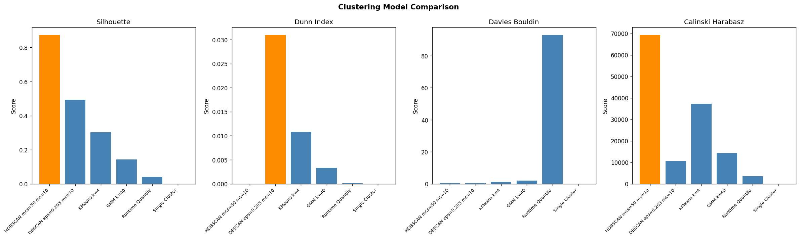
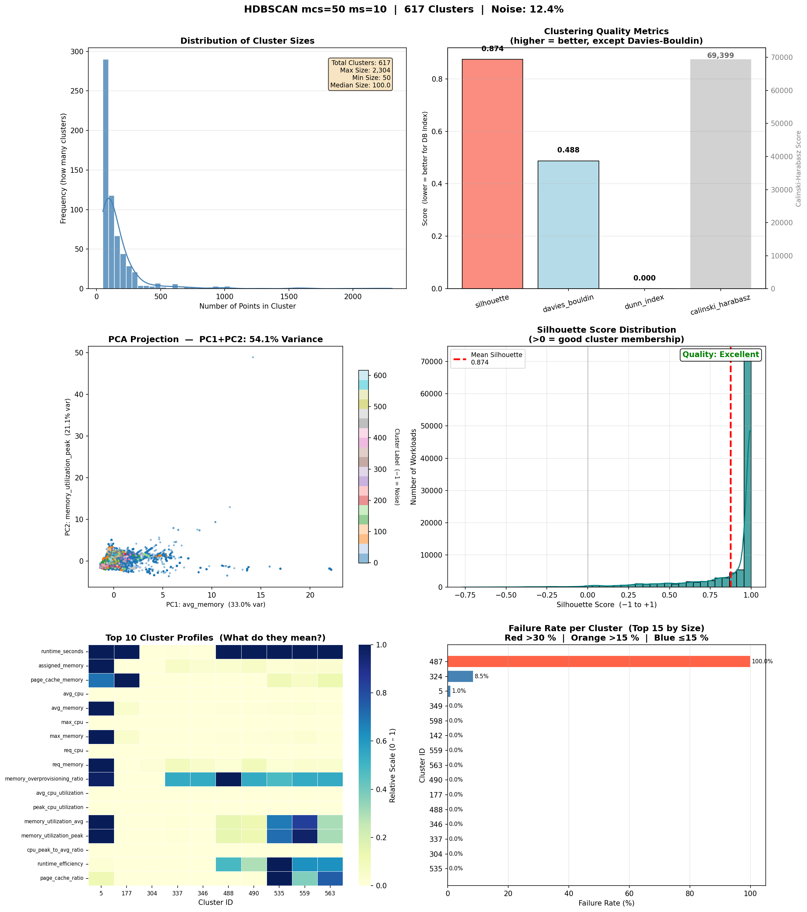
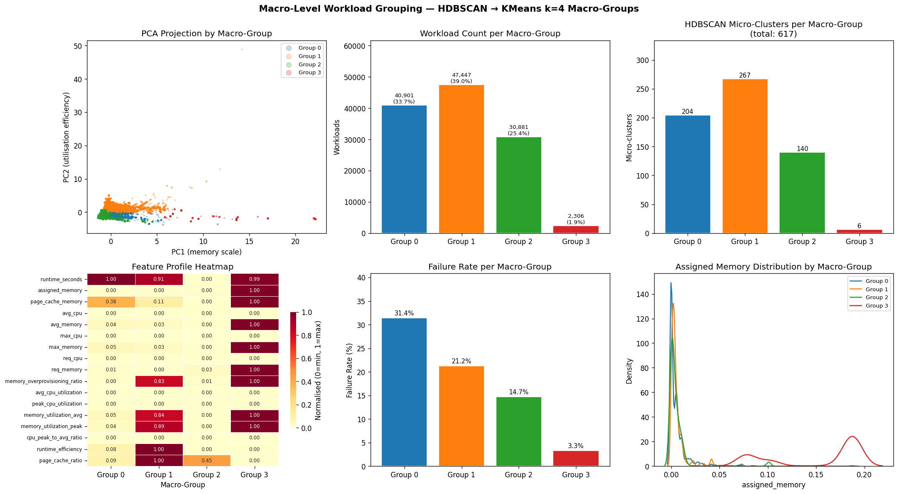

# Workload Profiler

**[📓 Full Analysis Notebook](./Workload_Profiler.ipynb)** &nbsp;·&nbsp; **[📊 Live App](https://workloadprofiler.streamlit.app)** &nbsp;·&nbsp; **[📄 Final Report](https://vinnybabumanjaly.github.io/WorkloadProfiler/)**


---

## Executive Summary

Large compute clusters treat every workload identically - same memory allocation, same scheduling rules - despite wildly different behaviour. This project applied unsupervised machine learning (HDBSCAN + KMeans) to 405,894 real tasks from Google's Borg cluster to automatically discover 4 distinct workload archetypes from resource usage patterns alone, with no manual labelling. The result: a 10x failure rate spread revealed (3.3% to 31.4%), memory reclamation targets identified for the highest-risk group, and concrete scheduling recommendations for each archetype. The primary model achieves a Silhouette Score of 0.874 and ARI stability of 0.9975 ± 0.0006.

---

## Rationale

Large compute clusters - whether Google Borg, Kubernetes, or cloud-hosted fleets - run hundreds of thousands of tasks simultaneously with no way to tell them apart. Every task gets the same scheduling rules and memory allocation regardless of how it actually behaves. The result: memory wasted on idle tasks, a 23% overall failure rate that hides a 10x spread across task types, and no actionable basis for differentiated scheduling. Understanding workload types is the prerequisite for any meaningful improvement in resource efficiency, failure reduction, or SLA design.

---

## Research Question

Can a machine learning model automatically discover what type of workload a task is - purely from how it uses resources - and use that to reduce waste, predict failures, and guide scheduling decisions?

---

## Data

The dataset is the **Google 2019 Cluster Trace** (`borg_traces_data.csv`, 405,894 rows, 34 columns), sourced via [Kaggle Hub](https://www.kaggle.com/datasets/google/google-cluster-sample). It records real task execution from Google's Borg cluster manager - memory allocations, CPU usage, runtime, failure status, and more. This is the authoritative public benchmark for large-scale workload analysis; a single well-documented source was used intentionally over combining partial or synthetic alternatives.

A **30% random sample (121,535 rows, `random_state=42`)** was used for modelling. Stability was validated by re-running the full pipeline 5 times on different random 80% sub-samples - confirming findings hold across any slice of the data (ARI 0.9975 ± 0.0006).

---

## Data Preparation

**Cleaning:**
- Removed records where `end_time <= start_time` (invalid runtime)
- Dropped rows missing `assigned_memory`, `average_usage`, `maximum_usage`, or `resource_request`
- Filled `vertical_scaling` with 0 (absence = no scaling applied); filled `scheduler` with mode value
- Capped all CPU, memory, and runtime values at the 1st–99th percentile to remove extreme outliers without data loss

**Feature extraction and encoding:**
- Parsed JSON string columns (`average_usage`, `maximum_usage`, `resource_request`) to extract numeric fields: `avg_cpu`, `avg_memory`, `max_cpu`, `max_memory`, `req_cpu`, `req_memory`
- Computed `runtime_seconds` from `start_time` and `end_time` timestamps
- Engineered 8 derived ratio features (memory utilisation, CPU burstiness, overprovisioning ratio - see Approach below)

**Scaling:**
`StandardScaler` applied to all 17 features before clustering. Distance-based algorithms are sensitive to feature magnitude; standardisation ensures no single large-valued column dominates. The scaler was fit on the working sample only.

**Train/test split:**
Unsupervised clustering does not use labelled train/test splits. The equivalent validation was: (1) a 30% random sample for modelling, and (2) ARI stability runs across 5 random 80% sub-samples with a threshold of ARI > 0.85.

---

## Approach

The project follows the **CRISP-DM** data science methodology. The learning type is **unsupervised** - no labels exist in the data; the model discovers workload types purely from resource usage patterns. The output is a cluster label (0–3) assigned to each workload instance, representing its archetype. Six models were built and compared:

| Model | Role |
| --- | --- |
| Single Cluster `k=1` | Baseline - no grouping |
| Runtime Quantile (6 bins) | Baseline - simplest possible grouping |
| DBSCAN `eps=0.203, ms=10` | Density-based - validation model |
| **HDBSCAN `mcs=50, ms=10`** | **Primary model - approved** |
| KMeans `k=4` | Macro labelling of HDBSCAN micro-clusters |
| GMM `k=40` | Probabilistic - eliminated (unstable results) |

**Hyperparameter selection:** DBSCAN eps tuned via k-distance graph; KMeans k selected via elbow method; GMM k selected via BIC minimisation. Model stability validated via Adjusted Rand Index (ARI) across 5 random 80% sub-samples.

**Evaluation metrics:** Silhouette Score (cohesion + separation), Davies-Bouldin Index (cluster compactness), Calinski-Harabasz Score (between/within dispersion ratio), and ARI (stability).



---

## Key Results

| Metric | Target | Result | Status |
| --- | --- | --- | --- |
| Silhouette Score | > 0.4 | **0.874** | Excellent ✓ |
| Davies-Bouldin Index | < 1.5 | **0.488** | Excellent ✓ |
| Calinski-Harabasz Score | Higher = better | **69,399** | Strong ✓ |
| Max cluster size | < 40% | **2.2%** | Excellent ✓ |
| Noise fraction | < 20% | **12.4%** | Met ✓ |
| Stability (ARI) | > 0.85 | **0.9975 ± 0.0006** | Excellent ✓ |

---

## Findings

HDBSCAN discovered **617 fine-grained micro-clusters**, consolidated into **4 workload archetypes** via KMeans nearest-centroid assignment. Each archetype has a distinct memory profile, failure rate, and operational implication.



| Archetype | Share | Failure Rate | Key Characteristic |
| --- | --- | --- | --- |
| ⚠️ Group 0 - Long-Running Over-Provisioned | 33.7% | **31.4%** | Above-average runtime, below-average memory use - classic over-provisioning |
| ✅ Group 1 - Memory-Efficient Standard | 39.0% | 21.2% | Uses almost exactly what it was given - highest utilisation efficiency |
| ⚡ Group 2 - Short-Running Lightweight | 25.4% | 14.7% | Very short runtime (−1.56 SD), most consistent behaviour of any group |
| 🔬 Group 3 - Memory-Intensive Specialist | 1.9% | **3.3%** | Extreme memory scale (+5.8 SD above mean), near-perfect reliability |



**Novel findings beyond original objectives:**

* **CPU carries zero signal.** All six CPU features show mean z-score 0.000 across all groups. Memory is the sole primary resource dimension - any CPU-based autoscaling model on this dataset would have nothing to work with.
* **Over-provisioning does not reduce failures.** Group 0 is the most over-provisioned and the highest-failure group simultaneously. Resource slack is not preventing failures; structural causes dominate.
* **The rarest workloads are the most reliable.** Group 3 (1.9% of workloads, highest memory consumption) has the lowest failure rate (3.3%) - consistent with dedicated infrastructure placement.
* **The 23% average failure rate hides a 10x spread.** No aggregate metric, runtime label, or priority field surfaces this - it only emerges from memory-behaviour clustering.

---

## Actionable Recommendations

* **Group 0:** Reclaim idle memory - reduce allocations toward actual average usage. Add failure alerting and retry policies. More memory will not fix this group.
* **Group 1:** Pack tightly on shared servers - these tasks use their allocation efficiently. Watch for occasional disk-read spikes when co-scheduling.
* **Group 2:** Ideal for dense, high-throughput scheduling. Short, predictable, and safe to pause and restart.
* **Group 3:** Assign to dedicated high-memory servers. Do not interrupt mid-run. Near-perfect reliability makes strong uptime commitments defensible.

---

## Next Steps

1. **Pre-run supervised classifier** - use archetype labels to train a classifier on submission-time features (`req_memory`, `assigned_memory`, priority) to enable real-time scheduling decisions
2. **Group 0 sub-segmentation** - drill into 204 micro-clusters to identify distinct failure sub-types within the highest-risk group
3. **Quantify memory reclamation savings** - convert Group 0 over-provisioning gap into a concrete capacity figure (GB recoverable per day)
4. **CPU data quality investigation** - determine whether zero CPU signal reflects Borg's scheduling design or a data quality issue in the 2019 trace

---

## Project Structure

```
WorkloadProfiler/
├── Workload_Profiler.ipynb      # Full analysis - single source of truth
├── app.py                       # Streamlit app router
├── pages/
│   ├── 0_Home.py                # Project summary and archetype cards
│   ├── 1_Cluster_Explorer.py    # PCA visualisation and archetype drill-down
│   ├── 2_Workload_Classifier.py # Input workload → classify → recommendations
│   └── 3_Key_Findings.py        # Business insights and model comparison
├── utils.py                     # Shared constants (names, colours, recommendations)
├── deployment/                  # Saved model artefacts and pre-computed data
├── plots/                       # All exported visualisations (PNG)
├── data/
│   └── google_cluster_sample/
│       └── borg_traces_data.csv # Raw dataset (313 MB - do not modify)
├── docs/
│   └── index.html               # Final report (GitHub Pages)
└── requirements.txt             # Python dependencies
```

## Run Locally

```bash
pip install -r requirements.txt
streamlit run app.py
```

App runs at `http://localhost:8501`. Run the artefact export cell in the notebook first if `deployment/` files are missing.

---

## Tools and Technologies

Python 3 · pandas · NumPy · scikit-learn · hdbscan · Matplotlib · Seaborn · Plotly · Streamlit · Jupyter Notebook

---

## Outline of Project

- [Full Analysis Notebook](./Workload_Profiler.ipynb) - CRISP-DM end-to-end: data preparation, 6 models, evaluation, deployment
- [Live Interactive App](https://workloadprofiler.streamlit.app) - Cluster Explorer, Workload Classifier, Key Findings
- [Final Report](https://vinnybabumanjaly.github.io/WorkloadProfiler/) - GitHub Pages summary

---

## License

This project is licensed under the [MIT License](./LICENSE).

---

## Contact and Further Information

**Vinny Babu**

- GitHub: [VinnyBabu](https://github.com/VinnyBabuManjaly)
- Project repository: [WorkloadProfiler](https://github.com/VinnyBabuManjaly/WorkloadProfiler)

For questions about the methodology, dataset, or findings, please open an issue on the repository.
